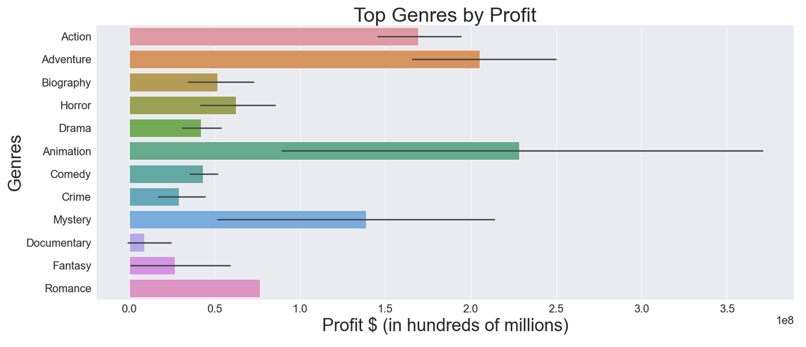
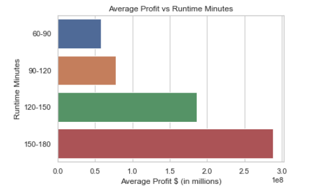
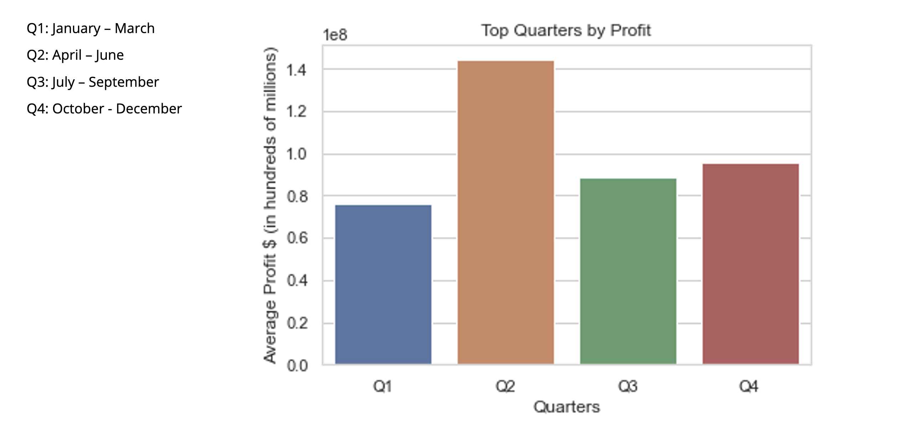
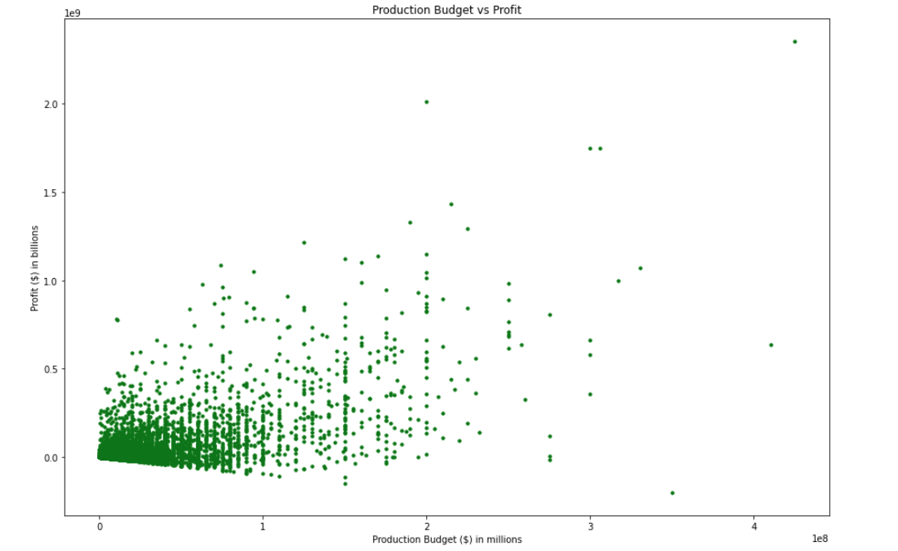

# Deloitte AI Academy - Capstone

## Introduction  

## Objectives 

1. Define the problem (prompt) 

2. Present our recommendation  

3. Provide supporting data analysis  

4. Provide statistical inference supporting recommendation 

5. Further action to help the implementation of recommendations 

##  Prompt 

Computing vision is faced with the problem of producing a top performing film. We are tasked with researching what type of film is most likely to outperform through data analysis.  

##  Business Recommendation 

Provide Computing Vision with a new direction for their first film by using statistically proven metrics to highlight key information.  

##  Final Result 

- Animation Genre 

- Run-time of 100 to 175 minutes 

- Release movie in the second quarter of the year 

##  Insights 

Using data visualizations and statistical methods the below four insights yielded the most positive results  

- Genres 

- Runtime  

- Quarter  

- Budget  

###  Genre 

Our data analysis is based on # films. Each film falls into one of these genres: action, adventure, biography, horror, drama, animation, comedy, crime, mystery, and documentary. The family genre was dropped because only one film was in this genre and its presence in our data showed that the family genre was the top performing genre which is misleading.  

Upon further analysis after dropping the family genre, we were able to find the average profit of each genre. 

bar graph here

The top 3 performing genres in order of performance are:  

- Animation  

- Adventure  

- Action  

With this analysis, we recommend that computing vision gears it resources towards making an animated film. 

###  Runtime

We also explored the possibility of runtime minutes in a film affecting the profit. We analyzed the data by breaking down the runtime in 30 minute intervals and taking the average of the profit for each interval. The results showed that the runtime interval with 150 to 180 runtime minutes had an average profit of 2.8 million. However, the amount of data for this interval was significantly smaller in comparison to the the other intervals. The second highest profit was between 120 and 150 runtime minutes with an average profit of 1.8 and contained a greater amount of data. Therefore, it would be safer to create a film that is around 120 to 150 minutes. 

###  Quarter 

A key insight that our team explored was what time frame the movie was released. To analyze this we broke the release dates into different quarters of the year. Grouping the release dates into quarters made it a lot easier to visualize the data and come up with a final conclusion. Each quarter yielded a profit of 0.97,1.3, 0.8,1.08 respectively. These values led us to believe that quarter two has the highest average profit of 1.3 and is why we recommend to release the movie in quarter 2 over all of the others. 

###  Budget

Our analysis shows us that a movie's performance is moderately correlated with its budget with a positive correlation of 0.676. It is therefore suggested to have a greater budget in order to maximize profit.

## Statistical Findings 

With our statistical analysis, we set out to find if the movies released in the 2nd quarter are likely to have a mean profit greater than the population's mean profit. The population mean profit was 101,275,270 USD and the sample mean profit was 144,140,263 USD with a standard deviation of 266,018,809 USD. The T statistic came out to be 2.93 and a critical value of 1.65 at a 5 percent significance level.  

### Hypothesis  

Ho: the mean of the sample is less than or equal to the population mean 

Ha: the mean of the sample is greater than the population mean 

### Statistical Conclusion: 

Our statistical analysis produced a p-value of 0.0018 which is less than our significant level of 0.05. We concluded that we should reject the null hypothesis because there is sufficient evidence to support the claim that average profit of the movies released in 2nd quarter is greater than the average profit of the population.  

## Next Steps  

The next steps section highlights an outline for future data visualization and statistical implementations that will continue with more information from the client.  Next steps that we include were to dive deeper into data sets finding proper casts, crews, and directors that could yield the highest profitably. Additionally we will launch a study into how sequels will perform given the data sets. Finally the client will be presented with merger and acquisition opportunities.  

## Conclusion

We recommend that for Computing vision’s first film, it is in their best interest to make an animated-genre film having a runtime of 100 to 175 minutes, released in the second quarter of the year.
